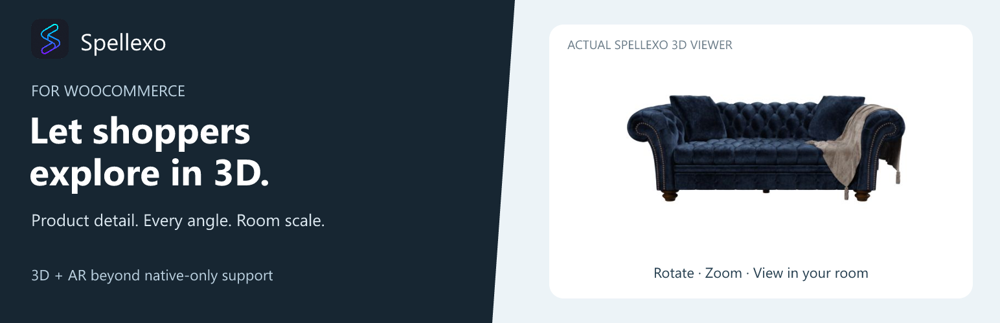
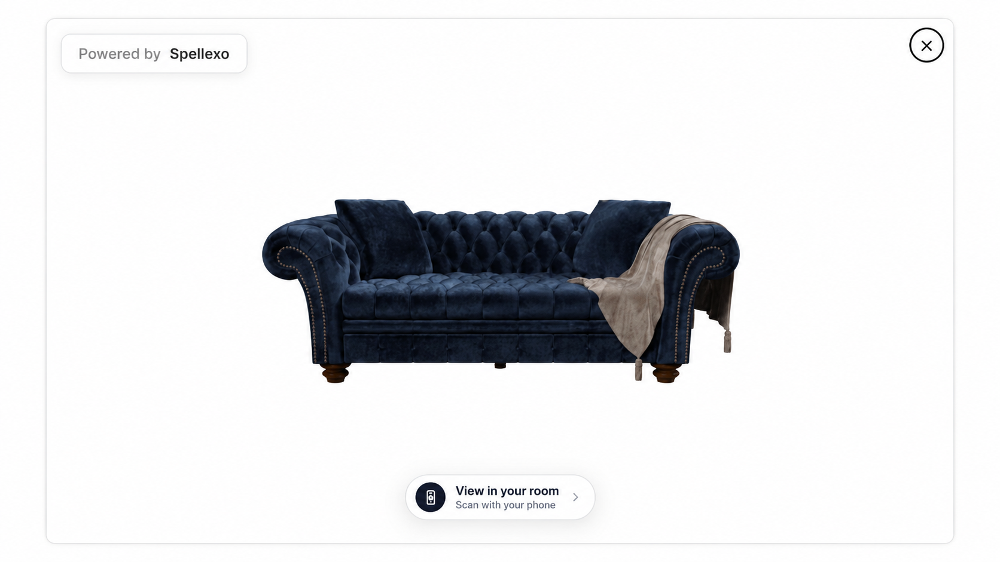

# Spellexo 3D & AR for WooCommerce

[Spellexo](https://www.spellexo.com/) lets shoppers explore your products from every angle and see how they fit in their own room, alongside your existing product photos.

**[Download the WordPress plugin](https://github.com/Mocoba5/spellexo-for-woocommerce/releases/latest)** · [Watch the demo](https://www.youtube.com/watch?v=3OgCWjlGBW4) · [Start free](https://dashboard.spellexo.com/)

## Bring your products to life

- Let shoppers rotate, zoom, and inspect materials, finishes, and fine details.
- Show products at room scale with augmented reality.
- Give products and individual variations their own 3D models.
- Place the viewer button using a WordPress block, Elementor widget, or shortcode.
- Manage models, product assignments, analytics, and your account in the Spellexo dashboard.

Spellexo's browser-based AR extends beyond devices with built-in native AR support, including many Android devices. A compatible mobile browser and camera permission are required.

## Install on your WooCommerce store

Requirements: WordPress 6.3+, WooCommerce 7.3+, PHP 7.4+, and an HTTPS storefront.

1. Open [GitHub Releases](https://github.com/Mocoba5/spellexo-for-woocommerce/releases/latest) and download **spellexo-for-woocommerce-0.1.0.zip** from **Assets**.
2. In WordPress, go to **Plugins → Add New → Upload Plugin**, select the ZIP, and click **Install Now**, then **Activate Plugin**.
3. Open **WooCommerce → Spellexo**, click **Connect to Spellexo**, and sign in or create your Spellexo account.
4. Synchronize your catalog, upload or request a model, assign it to a product or variation, and set it live within your plan limit.
5. Add **Spellexo — View In Your Room** to each applicable Single Product template using the WordPress block, Elementor widget, or shortcode: `[spellexo_view_in_your_room]`.

Your existing product gallery stays in place. The viewer opens when a shopper clicks **View In Your Room**. Products without an active model do not show an active viewer button.

## Start free, grow with your catalog

A Spellexo account is required. The Free plan needs no card and includes one active product or variation with **.spellexo** uploads. Paid plans support larger catalogs and also accept **.sog** Gaussian splat and **.glb** files.

The proprietary .spellexo format combines Gaussian splats with geometry and Spellexo's custom shaders for lifelike materials and product detail. Model creation and conversion services are quoted separately.

[Explore Spellexo for WooCommerce](https://www.spellexo.com/woocommerce-3d-product-viewer-plugin) · [Plans and pricing](https://www.spellexo.com/pricing)

## Help and privacy

See the [plugin guide](readme.txt) for setup, common questions, and service data disclosures. Manage subscriptions in the Spellexo dashboard; removing the plugin does not cancel a subscription.

[Spellexo website](https://www.spellexo.com/) · [Terms of Service](https://www.spellexo.com/terms) · [Privacy Policy](https://www.spellexo.com/privacy)
